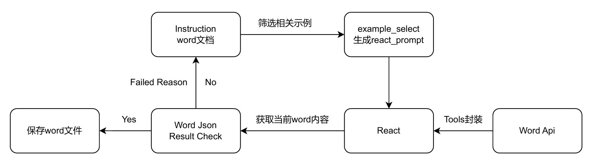

## wordgpt
大模型工具调用
word自动化


### 问题1：
大模型要能随时浏览到word的内容，要将python-docx库读取到的word转成一种大模型可以理解的格式

同时有时候需要将大模型输出的json格式内容转成word

python-docx库时一个纯python的库，
win32com.client是通过操作word生成文档，功能相比python-docx更为强大和灵活


要实现一个基于工具调用的大模型程序，通过 `win32com.client` 来生成 Word 文档或修改已有文档的格式，您需要封装一些常用的 API 以便大模型可以直接调用。以下是一个详细的包装实现，包括文档生成、段落、表格格式设置以及对文档的修改操作。

### 1. **文档管理 API**：

文档管理类封装了打开、保存、关闭 Word 文档的功能。

#### 文档管理 API：

```python
# 启动 Word 应用程序
def start_word():
    """ 启动 Word 应用程序并返回应用实例和文档对象 """
    global doc
    word = win32com.client.Dispatch("Word.Application")
    word.Visible = False  # 后台运行
    doc = word.Documents.Add()  # 创建一个新文档
    return word

# 打开现有文档
def open_document(word, file_path):
    """ 打开一个现有的 Word 文档 """
    doc = word.Documents.Open(file_path)
    return doc

# 创建新文档
def create_document(word):
    """ 创建一个新的空文档 """
    doc = word.Documents.Add()
    return doc

# 保存文档
def save_document(doc, file_path):
    """ 保存当前文档到指定路径 """
    if doc:
        doc.SaveAs(file_path)

# 关闭文档
def close_document(doc):
    """ 关闭当前文档 """
    if doc:
        doc.Close()

# 退出 Word 应用程序
def quit_word(word):
    """ 退出 Word 应用程序 """
    word.Quit()
```

### 2. **段落操作 API**：

段落是 Word 文档中的基本单位，您可以创建段落、设置段落格式（字体、字号、加粗、斜体、对齐方式等）。

#### 段落操作 API：

```python
# 添加段落并设置格式
def add_paragraph(text, style="正文", font_name="宋体", font_size=12, bold=False, italic=False, alignment=1):
    """ 添加段落并设置格式 """
    global doc
    para = doc.Content.Paragraphs.Add()  # 添加段落
    para.Range.Text = text  # 设置段落内容
    para.Style = style  # 设置段落样式
    para.Range.Font.Name = font_name  # 设置字体
    para.Range.Font.Size = font_size  # 设置字体大小
    para.Range.Font.Bold = bold  # 设置加粗
    para.Range.Font.Italic = italic  # 设置斜体
    para.Alignment = alignment  # 设置对齐方式

# 添加文档标题
def set_title(doc, title_text, style="标题 1", font_name="宋体", font_size=18):
    """ 设置文档标题 """
    title = doc.Content.Paragraphs.Add()
    title.Range.Text = title_text
    title.Style = style
    title.Range.Font.Name = font_name
    title.Range.Font.Size = font_size
    title.Range.ParagraphFormat.Alignment = 1  # 居中对齐

```

### 3. **文档格式修改 API**：

文档格式修改是对现有文档进行修改，包括段落、表格、标题等的格式调整。

#### 文档格式修改 API：

```python
# 设置段落对齐方式
def set_paragraph_alignment(para, alignment):
    """ 设置段落对齐方式 """
    para.Alignment = alignment  # 0-左对齐，1-居中对齐，2-右对齐

# 设置段落字体和字号
def set_paragraph_font(para, font_name, font_size):
    """ 设置段落字体和字号 """
    para.Range.Font.Name = font_name
    para.Range.Font.Size = font_size

# 设置段落加粗
def set_paragraph_bold(para, bold):
    """ 设置段落加粗 """
    para.Range.Font.Bold = bold

# 设置段落斜体
def set_paragraph_italic(para, italic):
    """ 设置段落斜体 """
    para.Range.Font.Italic = italic

# 修改段落样式
def modify_paragraph_style(doc, paragraph_index, style="正文", font_name="宋体", font_size=12):
    """ 修改段落样式 """
    para = doc.Paragraphs(paragraph_index)
    para.Style = style
    para.Range.Font.Name = font_name
    para.Range.Font.Size = font_size
```

### 5. **选择器 API**：

选择器用于从文档中选择元素，如段落、表格等，您可以根据条件选择需要操作的元素。

#### 选择器 API：

```python
# 根据条件选择段落
def select_paragraphs(doc, filter_fn=None):
    """ 根据条件选择段落 """
    paragraphs = []
    for para in doc.Paragraphs:
        if filter_fn and filter_fn(para):
            paragraphs.append(para)
    return paragraphs
```

### 6. **执行器 API**：

执行器用于实际对选择的元素进行修改，例如修改段落文本、表格内容等。

#### 执行器 API：

```python
# 修改段落文本
def modify_paragraph(doc, paragraph_index, new_text):
    """ 修改段落文本 """
    para = doc.Paragraphs(paragraph_index)
    para.Range.Text = new_text
```

### 7. **验证器 API**：

验证器用于验证文档是否符合指定的要求，例如检查段落格式、字体大小等。


### 总结：

1. **文档管理 API**：用于打开、创建、保存和关闭 Word 文档。
2. **段落操作 API**：用于操作段落的文本、样式、字体、对齐方式等。
3. **表格操作 API**：用于操作表格的内容、样式、字体、单元格内容等。
4. **文档格式修改 API**：用于修改文档的标题、段落和表格的格式。
5. **选择器、执行器和验证器**：用于选择要操作的文档元素，执行相应的修改操作，并验证操作是否成功。


### Word 文档操作与任务验证自动化
自动化地操作 Word 文档，包括创建、保存、修改段落样式、设置标题等，同时通过大模型（如 ChatOpenAI）来判断任务是否完成。项目的核心是通过封装 Word 操作的 API，结合 React 的任务执行与动态选择任务示例，来自动化执行文档任务并验证其结果。

### 功能概述
封装的 Word 操作 API：本项目提供了一系列封装的 API 来操作 Word 程序。主要操作包括打开 Word 程序、创建新文档、保存文档、关闭文档、添加段落并设置格式、设置标题、退出程序等。

### 主要 API：

start_word(input_json)：启动 Word 程序。

create_document(input_json)：创建一个新文档。

save_document(input_json)：保存文档到指定路径。

close_document(input_json)：关闭文档。

quit_word(input_json)：退出 Word 程序。

add_paragraph(input_json)：在文档中添加段落，并设置其字体、字号、对齐方式等格式。

React 模型接口工具：为了能根据用户任务动态执行和选择最相关的任务，我们使用 Tool 封装上述 API 作为 React 的工具函数，结合大模型动态选择最相关的任务示例。

### 工具函数示例：

modify_paragraph_style：修改多个段落的样式。

modify_paragraph：修改指定段落的文本内容。

get_word_content：获取文档内容的 JSON 格式，用于任务完成的检查。

动态示例筛选：当用户提交任务指令时，系统会根据任务指令从事先积累的任务示例中选择最相关的三个任务，并动态将它们嵌入到提示词（react_prompt）中，作为参考示例来帮助大模型理解任务要求。

任务验证与反馈：执行完 Word 操作后，通过获取 Word 文档的 JSON 格式内容，调用大模型判断是否完成了任务。如果任务完成，返回 yes，否则返回 no，并继续执行任务直到任务完成。

### 项目结构
Word 操作 API：提供了 Word 操作的基本封装，供 React 系统调用。

React 提示词：设计了动态任务选择和任务完成验证的提示词模板。

任务选择与验证：在任务执行过程中，结合 LLMChain 来根据输入任务指令选择相关任务示例，并用大模型判断任务完成情况。


